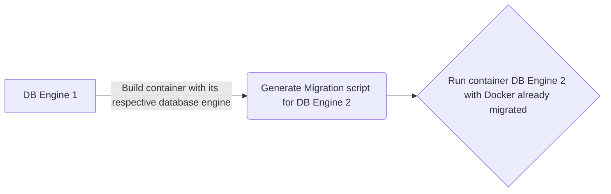

# DtoB
This is a multimigration project for automatization of db migrations according to the db desired to migrate

### Flow diagram

```mermaid
graph LR
A[DB Engine 1] -- Build container with its respective database engine --> B(Generate Migration script for DB Engine 2)
B --> D{Run container DB Engine 2 with Docker already migrated }

```

<!-- ```mermaid
sequenceDiagram

``` -->